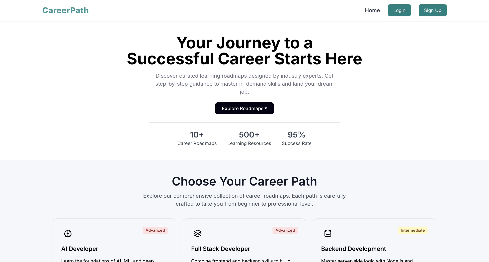
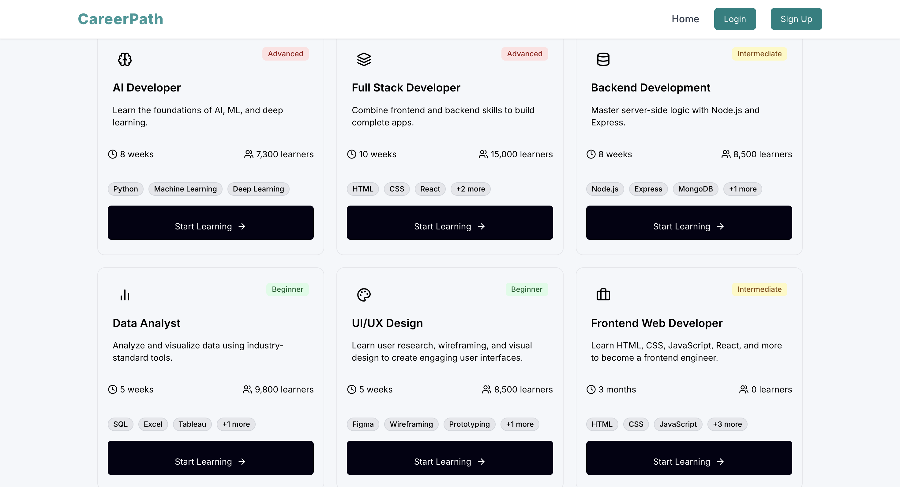
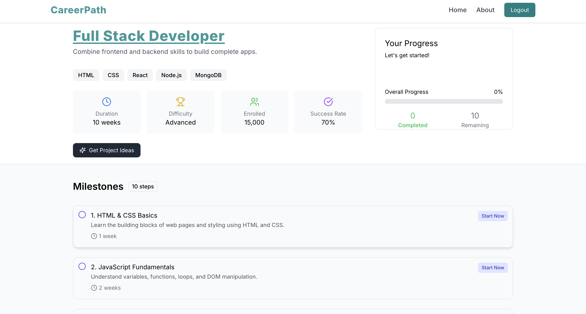
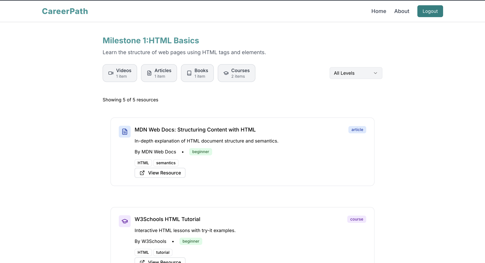
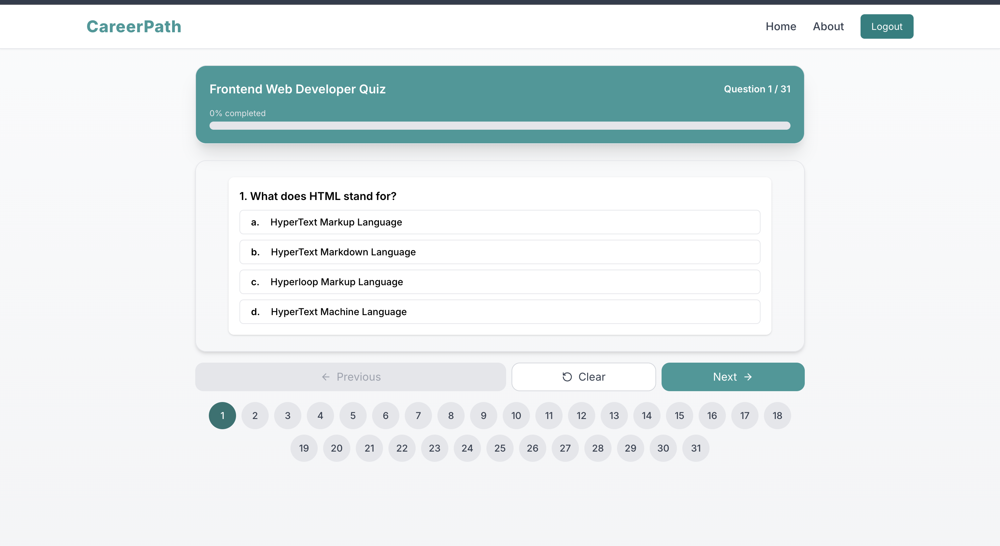
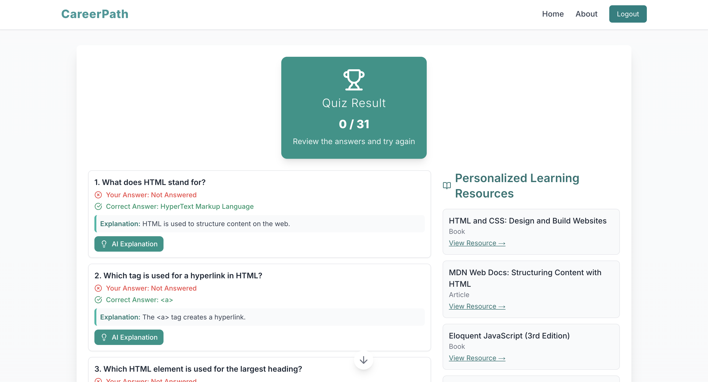
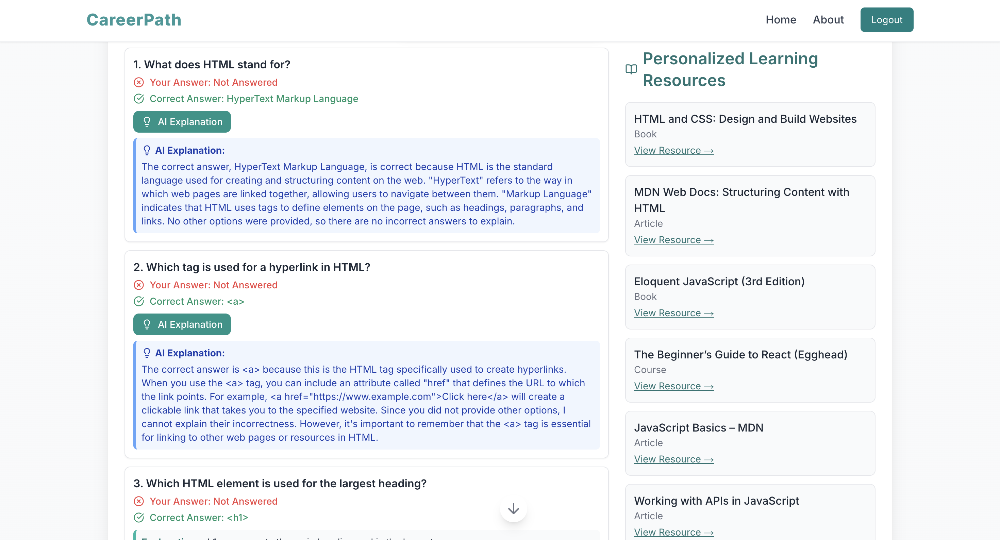

# CareerPath — AI Powered Personalized Learning Platform

CareerPath is a full-stack AI-powered learning platform that helps aspiring developers follow structured career roadmaps, track learning progress, assess their knowledge through quizzes, receive AI-generated explanations for incorrect answers, generate personalized project ideas, and discover learning resources based on their weak areas.

Unlike traditional roadmap websites, CareerPath adapts to each learner by combining curated learning content with Generative AI to deliver a personalized and interactive learning experience.

---

# Live Demo

### Frontend
https://careerpath-roadmap-builder.vercel.app

### Backend API
https://careerpath-backend-1.onrender.com

---

# Features

## Authentication

- Email & Password Authentication
- Google OAuth Login
- Secure session management with NextAuth
- Protected Routes
- Persistent User Sessions

---

## Career Roadmaps

- Multiple career paths
- Structured Beginner → Advanced learning journey
- Milestone-based progression
- Progress tracking
- Organized learning resources

---

## AI Project Generator

Generate resume-ready projects tailored to your learning roadmap.

Users can:

- Select any career roadmap
- Choose project difficulty
- Generate unique AI-powered project ideas
- Receive roadmap-specific project suggestions

---

## Quiz Engine

- Topic-wise quizzes
- Interactive question navigation
- Progress indicator
- Instant scoring
- Answer review after submission

---

## AI Explanations

For every incorrect answer, users can generate AI explanations that include:

- Why their answer is incorrect
- Correct answer explanation
- Concept clarification
- Learning insights

Powered using Large Language Models through OpenRouter.

---

## Personalized Learning Resources

Instead of showing generic resources, CareerPath recommends learning material based on quiz performance and weak concepts.

This creates an adaptive learning experience tailored to every user.

---

## Dashboard

- Overall learning progress
- Milestone completion tracking
- Resource completion status
- Personalized learning statistics

---

# Screenshots

## Home Page

<p align="center">

</p>

---

## Roadmaps

<p align="center">

</p>

---

## AI Project Generator

<p align="center">

</p>

<p align="center">

</p>

---

## Milestone Learning

<p align="center">

</p>

---

## Resources(Inside each Milestone)

<p align="center">

</p>

---

## Quiz

<p align="center">

</p>

---

## Quiz Results

<p align="center">

</p>

---

## AI Explanation

<p align="center">

</p>

---

# Tech Stack

## Frontend

- Next.js
- React.js
- Tailwind CSS
- Zustand
- NextAuth

### Backend

- Node.js
- Express.js
- MongoDB Atlas
- Mongoose

### Authentication

- NextAuth
- Google OAuth
- Credentials Provider

### AI

- OpenRouter API
- Prompt Engineering

### Deployment

- Vercel
- Render

---

# Architecture

```
                    User
                      │
                      ▼
             Next.js Frontend
                      │
                      ▼
         NextAuth Authentication
                      │
                      ▼
             Express.js Backend
                      │
                      ▼
              MongoDB Atlas Database
                      │
      ┌───────────────┼────────────────┐
      │               │                │
      ▼               ▼                ▼
AI Explanations   AI Projects   Personalized Resources
```

---

# Folder Structure

```
CareerPath
│
├── frontend
│   ├── app
│   ├── components
│   ├── context
│   ├── lib
│   ├── hooks
│   └── public
│
├── backend
│   ├── controllers
│   ├── middleware
│   ├── models
│   ├── routes
│   ├── config
│   └── utils
│
└── README.md
```

---

# AI Features

CareerPath integrates Generative AI to create a personalized learning experience.

### AI Project Generator

- Resume-ready project ideas
- Difficulty-based generation
- Roadmap-specific suggestions

### AI Explanations

- Explain incorrect quiz answers
- Clarify concepts
- Improve understanding

### Personalized Recommendations

- Detect weak topics
- Recommend targeted learning resources
- Adaptive learning workflow

---

# Installation

## Clone Repository

```bash
git clone https://github.com/Karan-codes1/careerpath-roadmap-builder.git
```

## Frontend

```bash
cd frontend
npm install
npm run dev
```

## Backend

```bash
cd backend
npm install
npm run dev
```

---

# Environment Variables

## Frontend (.env.local)

```env
NEXTAUTH_URL=

NEXTAUTH_SECRET=

GOOGLE_CLIENT_ID=

GOOGLE_CLIENT_SECRET=

NEXT_PUBLIC_BASE_URL=
```

---

## Backend (.env)

```env
MONGO_URI=

JWT_SECRET=

OPENROUTER_API_KEY=
```

---

# Future Improvements

- AI-generated quizzes
- AI Mentor Chatbot
- Skill Analytics Dashboard
- Smart Roadmap Recommendations
- Daily Learning Streaks
- Achievement Badges
- Certificate Generation
- Leaderboard
- Dark Mode

---

# Author

### Karan Raj

**LinkedIn**

https://www.linkedin.com/in/karan-raj2005/

**GitHub**

https://github.com/Karan-codes1