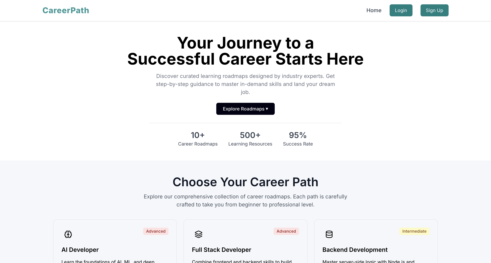
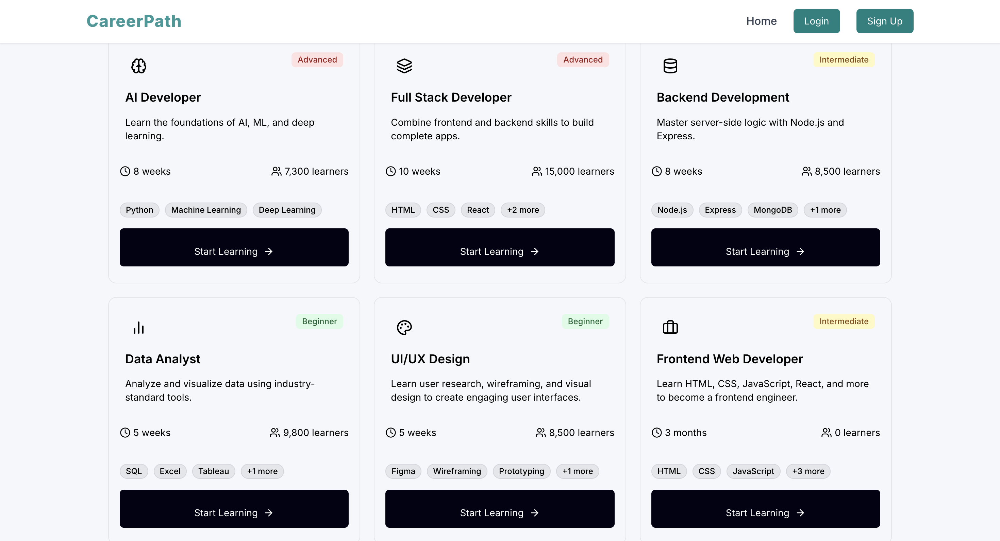
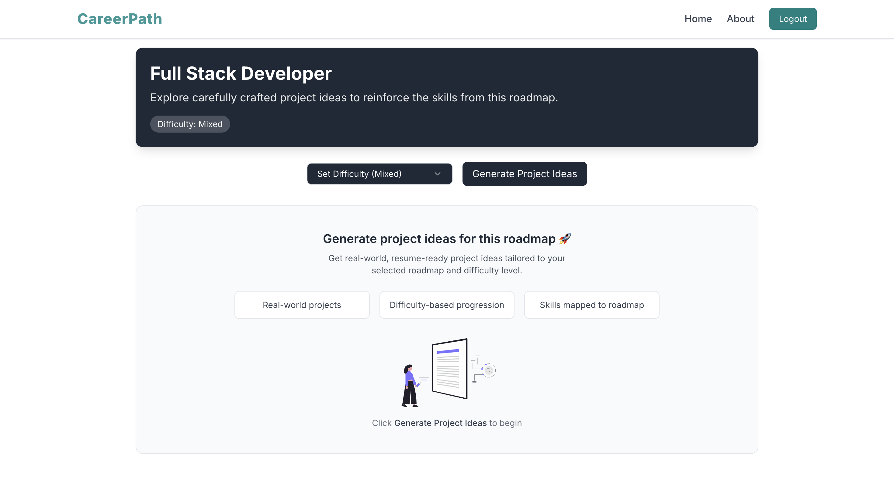
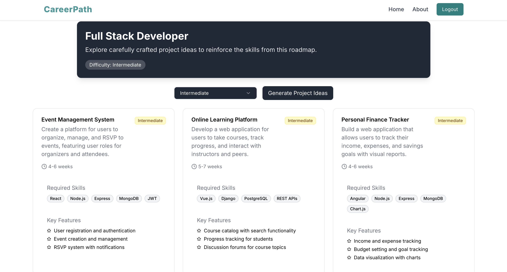
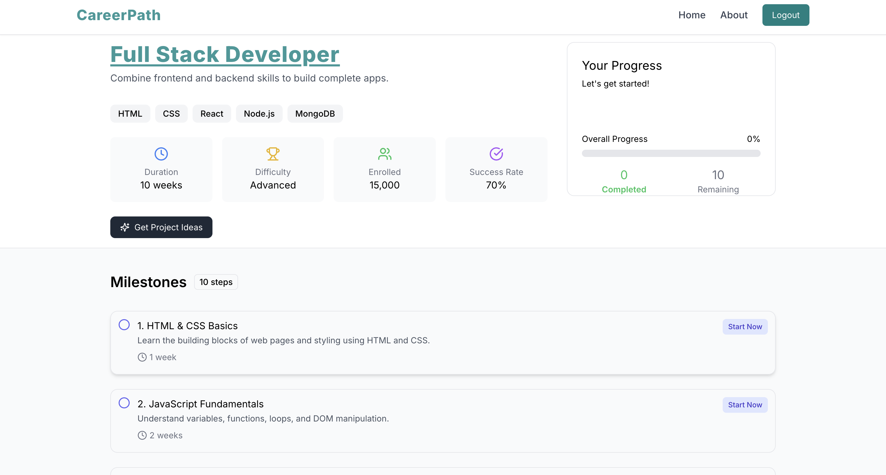
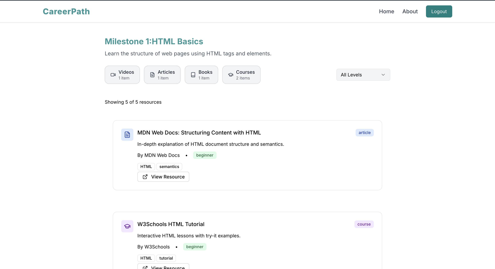
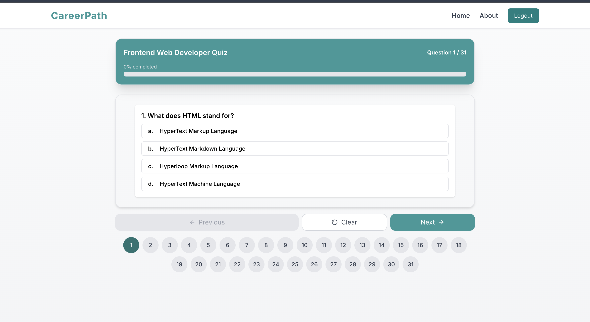
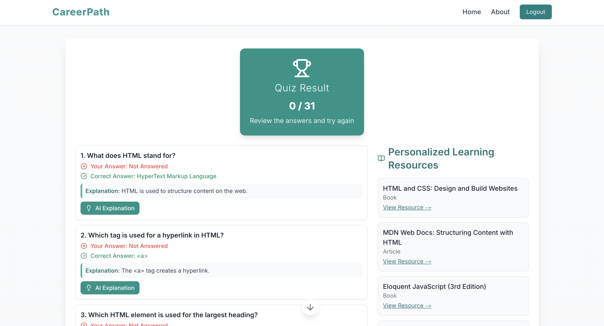
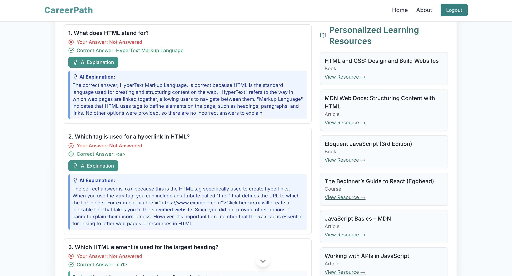

# CareerPath — AI Powered Personalized Learning Platform

CareerPath is a full-stack AI-powered learning platform that helps aspiring developers follow structured career roadmaps, track learning progress, assess their knowledge through quizzes, get AI-generated explanations for quiz answers, generate personalized project ideas, and discover learning resources based on their weak areas.

Unlike traditional roadmap websites, CareerPath adapts to each learner by combining curated learning content with Generative AI to deliver a personalized and interactive learning experience.

---

# Live Demo

### Frontend
https://careerpath-roadmap-builder.vercel.app

### Backend API
https://careerpath-backend-1.onrender.com

---

# Features

## Authentication

- Email & password sign-up and login (passwords hashed with bcrypt)
- Google Sign-In (Google ID token verified on the backend)
- Session stored as a JWT in an `httpOnly` cookie, so it is never readable from JavaScript
- Protected pages on the frontend and protected API routes on the backend
- Role-based authorization: only admin accounts can create, edit or delete content
- Session survives page reloads and expires after 1 hour

---

## Career Roadmaps

- Multiple career paths
- Structured Beginner → Advanced learning journey
- Milestone-based progression
- Per-user progress tracking (completed / remaining milestones and overall percentage)
- Curated learning resources inside every milestone, filterable by type and difficulty

---

## AI Project Generator

Generate resume-ready projects tailored to your learning roadmap.

Users can:

- Open the generator from any career roadmap
- Choose a difficulty (Beginner, Intermediate, Advanced or Mixed)
- Generate three AI-powered project ideas at a time
- See the duration, required skills and key features of each idea

---

## Quiz Engine

- A quiz for each roadmap
- Interactive question navigation
- Progress indicator
- Instant scoring
- Answer review after submission

---

## AI Explanations

On the results page, users can generate an AI explanation for any question, covering:

- Why their answer is incorrect (or why it is correct)
- Why the correct answer is right
- The concept behind the question

The backend looks up the question and its correct answer in the database, so the client never decides what "correct" means.

Powered by the OpenAI API (`gpt-4o-mini`).

---

## Personalized Learning Resources

Instead of showing generic resources, CareerPath recommends learning material based on quiz performance:

1. The backend grades the submitted answers against the database.
2. AI identifies the concepts behind the wrong answers.
3. Matching resources are fetched from the database.
4. AI picks the most relevant ones — by ID only, so every link shown comes from the curated database.

---

# Screenshots

## Home Page

<p align="center">

</p>

---

## Roadmaps

<p align="center">

</p>

---

## AI Project Generator

<p align="center">

</p>

<p align="center">

</p>

---

## Milestone Learning

<p align="center">

</p>

---

## Resources (Inside each Milestone)

<p align="center">

</p>

---

## Quiz

<p align="center">

</p>

---

## Quiz Results

<p align="center">

</p>

---

## AI Explanation

<p align="center">

</p>

---

# Tech Stack

### Frontend

- Next.js 14 (App Router)
- React 18
- Tailwind CSS
- Zustand (client-side caching of roadmap data)
- Axios
- Radix UI and lucide-react

### Backend

- Node.js
- Express.js 5
- MongoDB Atlas
- Mongoose
- Joi (request validation)

### Authentication

- JWT in an `httpOnly` cookie (`jsonwebtoken`, `cookie-parser`)
- Google Sign-In (`google-auth-library`)
- Email & password (`bcrypt`)

### AI

- OpenAI API (`gpt-4o-mini`)
- Prompt Engineering

### Deployment

- Vercel (frontend)
- Render (backend)

---

# Architecture

```
                    User
                      │
                      ▼
       Next.js Frontend (Vercel)
                      │
                      │  Axios requests carrying the httpOnly JWT cookie
                      ▼
       Express.js Backend (Render)
        JWT verification middleware
                      │
          ┌───────────┴───────────┐
          │                       │
          ▼                       ▼
   MongoDB Atlas              OpenAI API
 roadmaps · milestones      explanations · project ideas
 resources · quizzes        resource recommendations
 users · progress
```

---

# Authentication Flow

1. The user signs up or logs in with email and password, or with Google Sign-In.
2. For Google, the browser receives an ID token from Google and sends it to the backend, which verifies it with `google-auth-library`.
3. The backend signs its own JWT and sets it as an `httpOnly` cookie named `token` (valid for 1 hour).
4. The frontend sends the cookie automatically with every request (`withCredentials: true`). On load it calls `GET /auth/me` to find out whether a session exists.
5. Protected API routes run the `ensureAuthenticated` middleware, which verifies the cookie and attaches the user to the request.
6. Logging out calls `POST /auth/logout`, which clears the cookie.

In production (`NODE_ENV=production`) the cookie is set with `Secure` and `SameSite=None`, because the frontend and backend run on different domains. Locally it uses `SameSite=Lax`.

---

# Folder Structure

```
CareerPath
│
├── frontend
│   ├── app            # pages: home, login, signup, roadmap, resource, quiz, projects, about, dashboard, profile
│   ├── components     # Navbar, cards, quiz components, GoogleLoginButton, ui/
│   ├── context        # AuthContext (session state, login / signup / logout)
│   ├── store          # Zustand stores for roadmaps
│   ├── utils          # Axios instance
│   └── public
│
├── backend
│   ├── controller     # request handlers
│   ├── Middlewares    # JWT auth, request validation
│   ├── models         # Mongoose models and DB connection
│   ├── routes         # Express routers
│   └── index.js       # app entry point
│
├── screenshots
└── README.md
```

---

# API Overview

| Route | Purpose |
| --- | --- |
| `POST /auth/signup`, `POST /auth/login` | Email & password authentication |
| `POST /auth/google` | Google Sign-In |
| `POST /auth/logout` | Clear the session cookie |
| `GET /auth/me` | Current logged-in user |
| `GET /roadmap` | List all roadmaps (public) |
| `GET /roadmap/:roadmapId` | Roadmap with the user's milestone status |
| `GET /roadmap/:roadmapId/progress` | The user's progress on a roadmap |
| `PUT /roadmap/:roadmapId` | Update a milestone's status |
| `GET /resource/milestone/:milestoneId` | Resources of a milestone |
| `GET /quiz/:roadmapId` | Quiz for a roadmap |
| `POST /ai/projects` | Generate project ideas |
| `POST /ai/explanation` | Explain a quiz answer |
| `POST /ai/recommendations` | Recommend resources from quiz results |

All routes except `GET /roadmap`, `GET /resource/milestone/:milestoneId` and the signup / login / Google / logout routes require a logged-in session.

### Admin-only routes

Creating or changing content needs an account with `role: "admin"`. Everyone else gets `403 Forbidden`.

| Route | Purpose |
| --- | --- |
| `POST /roadmap` | Create roadmaps |
| `POST /milestone/:roadmapId`, `PUT /milestone/:id`, `DELETE /milestone/:id` | Create, update, delete milestones |
| `POST /resource/:milestoneId`, `PUT /resource/:id`, `DELETE /resource/:id` | Create, update, delete resources |
| `POST /quiz` | Create a quiz |

### Rate limits

Requests over a limit get `429 Too Many Requests`. Counters live in the server's memory (`backend/Middlewares/RateLimit.js`).

| Applies to | Counted per | Limit |
| --- | --- | --- |
| Every request | IP address | 300 per 15 minutes |
| Failed logins (`/auth/login`, `/auth/google`) | IP address | 10 per 15 minutes |
| `/auth/signup` | IP address | 10 per hour |
| AI routes (`/ai/*`) | Account | 20 per hour and 50 per day |

New accounts are always created as `user`. To make an account an admin, run this from the `backend` folder:

```bash
node scripts/makeAdmin.js you@example.com
```

---

# Installation

## Clone Repository

```bash
git clone https://github.com/Karan-codes1/careerpath-roadmap-builder.git
cd careerpath-roadmap-builder
```

## Backend

```bash
cd backend
npm install
npm run dev
```

The API starts on `http://localhost:8080` (or the `PORT` you set). In production, start it with `node index.js`.

## Frontend

```bash
cd frontend
npm install
npm run dev
```

The app starts on `http://localhost:3000`.

---

# Environment Variables

## Frontend (`frontend/.env.local`)

```env
NEXT_PUBLIC_BASE_URL=http://localhost:8080

NEXT_PUBLIC_GOOGLE_CLIENT_ID=
```

| Variable | Description |
| --- | --- |
| `NEXT_PUBLIC_BASE_URL` | URL of the backend API |
| `NEXT_PUBLIC_GOOGLE_CLIENT_ID` | Google OAuth client ID. The Google button is hidden if this is not set |

## Backend (`backend/.env`)

```env
PORT=8080

mongoUrl=

JWT_SECRET=

NODE_ENV=development

OPENAI_API_KEY=

GOOGLE_CLIENT_ID=
```

| Variable | Description |
| --- | --- |
| `PORT` | Port the API listens on (defaults to 8080) |
| `mongoUrl` | MongoDB connection string |
| `JWT_SECRET` | Secret used to sign session tokens |
| `NODE_ENV` | `development` locally, `production` when deployed (controls the cookie settings) |
| `OPENAI_API_KEY` | OpenAI API key for the AI features |
| `GOOGLE_CLIENT_ID` | The same Google OAuth client ID as the frontend |

## Google Sign-In setup

Create an OAuth 2.0 Client ID (Web application) in Google Cloud Console and add every frontend URL — `http://localhost:3000` and the deployed domain — under **Authorized JavaScript origins**. Use the same client ID in both the frontend and the backend.

## Deploying to your own domain

The backend only accepts browser requests from the origins listed in the CORS configuration in `backend/index.js`. Add your frontend's URL there if you deploy it somewhere else.

---

# Future Improvements

- Learning dashboard with detailed statistics
- AI-generated quizzes
- AI Mentor Chatbot
- Smart Roadmap Recommendations
- Daily Learning Streaks
- Achievement Badges
- Certificate Generation
- Leaderboard
- Dark Mode

---

# Author

### Karan Raj

**LinkedIn**

https://www.linkedin.com/in/karan-raj2005/

**GitHub**

https://github.com/Karan-codes1
